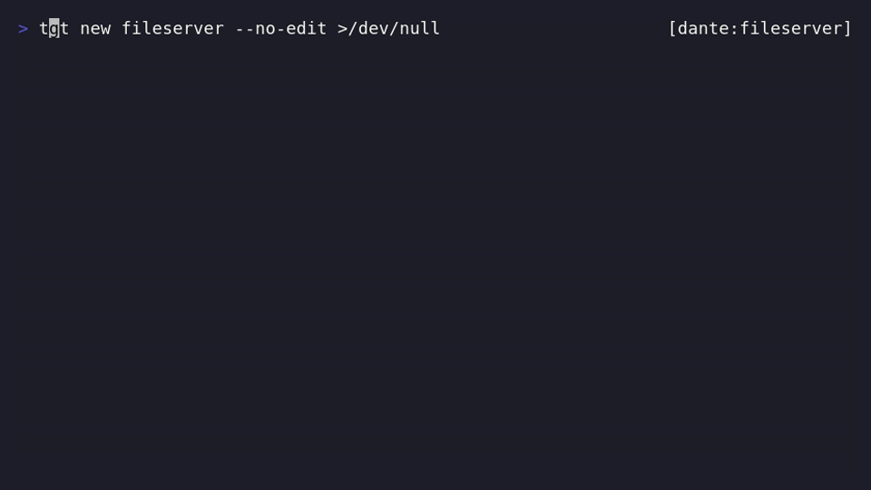
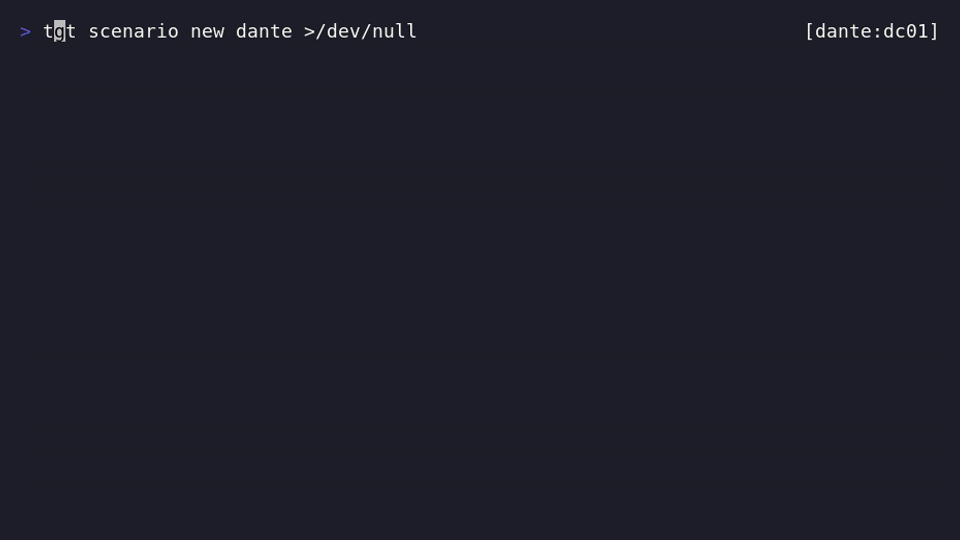
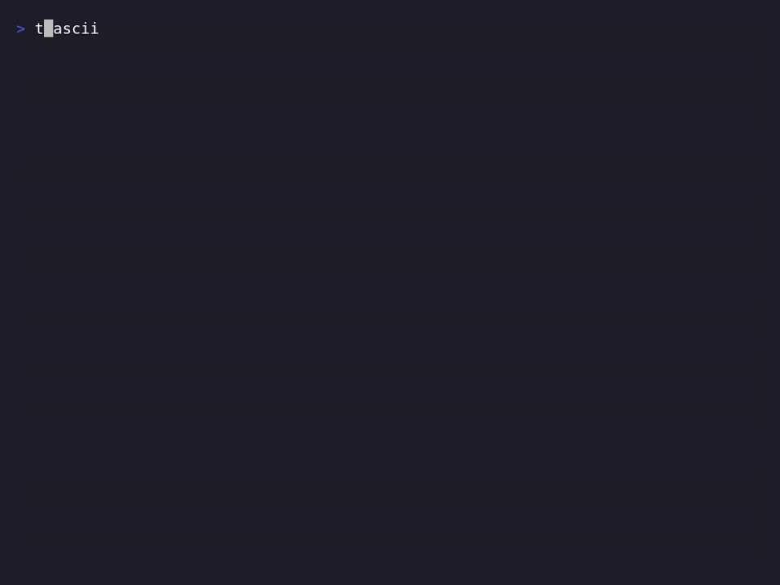

# tgt

A [fish shell](https://fishshell.com/) plugin for managing pentesting
target environments. Tested on Arch, Parrot OS, and Kali.

`tgt` tracks the hosts you're working on — IP, hostnames, ports,
credentials, AD realms — and the system files those touch
(`/etc/hosts`, `/etc/krb5.conf`, per-engagement workspace folders).
Targets group into **scenarios**, so a Pro Lab season or client
engagement is one namespace; switching targets pulls up the right
details and updates the system files in lock-step.

There's also a localhost web UI (`tgt-web`) that exposes the same
data and operations through a browser — convenient for reviewing
state, editing fields, and managing multiple scenarios without
typing CLI commands for every change.

Additional features: a `[scenario:target:port@dc+cred]` prompt
segment, fzf pickers, archive support for finished engagements,
nmap port-record import, and a gum-based config wizard when
[`gum`](https://github.com/charmbracelet/gum) is installed.


## Concepts

| Term | What it means |
|---|---|
| **scenario** | An engagement, HTB Pro Lab season, or client. Holds many targets, credentials, and DCs. |
| **target** | One box / host. IP, hostnames, ports. |
| **credential** | A username / password (or hash) pair, scenario-level. You typically collect several (foothold, lateral, DA) and pivot with `tgt cred switch`. |
| **DC** | A krb5 realm definition (per-scenario), used by AD tools that consume `/etc/krb5.conf`. |
| **workspace** | Optional per-scenario / per-target directory tree (scans, loot, exploits, notes) for tidy reporting. |


## CLI at a glance



`tgt scenario show` is the per-scenario dashboard: every target's
host and hostname count, plus the scenario's credentials and DCs in
their own sections (the active one in each is starred). Data is
read straight from the registry — no shell env pollution to
inspect it.


## Web UI

`tgt-web` is a localhost-only HTTP UI (`127.0.0.1`, no auth — same
threat model as `fish_config`) for browsing and editing the same
data. It reads `$TGT_HOME` directly, mirrors every CLI mutation to
`tgt` under the hood, and updates live across shells via SSE so a
`tgt scenario switch` in one terminal flips the dashboard
immediately.

**Install + run:**

```bash
pipx install "git+https://github.com/EUSEC-io/tgt#subdirectory=web"
tgt-web                 # binds to a random port, opens the browser
tgt-web --port 8080     # pin a port
tgt-web --no-open       # don't auto-open
```

**What it covers:**

- All scenarios / targets / credentials / DCs / ports — list, add,
  edit, rename, remove. Same shape on disk; same `tgt` verbs under
  the hood.
- Inline forms for `cred new` / `cred edit` / `dc new` / `dc edit` /
  `scenario new` / `target edit` / `ports add` / `ports rm` /
  `ports comment` / `ports service`.
- Switch / unset / revoke / archive flows behind confirmation
  modals with a dry-run preview of the exact `tgt` command.
- Per-target ports manager: add, remove, rename service, edit
  comment — inline editable cells with imperative DOM updates so
  unsaved edits don't get clobbered by background refreshes.

**Sudo and graphical password prompts:** the writers
(`/etc/hosts`, `/etc/krb5.conf`) shell out to `sudo install`. When
launched from a non-terminal context, `tgt-web` probes for a
graphical askpass helper (zenity / kdialog / ssh-askpass) and
points `SUDO_ASKPASS` at a wrapper. The dialog body reports the
specific `tgt` action that triggered the prompt, so you see e.g.
`Sudo password — tgt-web: tgt scenario switch acme`. CLI
invocations keep sudo's default TTY prompt unchanged.

See [web/ARCHITECTURE.md](web/ARCHITECTURE.md) for the design
discussion (stdlib-only Python, no build step, Alpine.js for state).


## Install

### Dependencies

| Package | Required for | Arch | Debian / Parrot / Kali |
|---|---|---|---|
| `fish` | the shell | `fish` | `fish` |
| `fzf` | switch picker (no-arg `tgt switch` etc.) | `fzf` | `fzf` |
| `pipx` | installing `tgt-web` (optional) | `python-pipx` | `pipx` |
| `gum` | nicer wizards (optional, but worth it) | `gum` | `gum` |
| `tree` | nicer `tgt workspace` visualization (optional) | `tree` | `tree` |
| `zenity` / `kdialog` / `ssh-askpass` | graphical sudo prompts for `tgt-web` (optional) | `zenity` or `kdialog` | `zenity` or `ssh-askpass` |

Most are pre-installed on pentesting-focused distros. Arch:

```bash
sudo pacman -S fish fzf python-pipx gum tree
```

Parrot / Kali / Debian:

```bash
sudo apt install fish fzf pipx gum tree
```

For development, you also need Fisher and Fishtape:

```fish
curl -sL https://raw.githubusercontent.com/jorgebucaran/fisher/main/functions/fisher.fish | source
fisher install jorgebucaran/fisher jorgebucaran/fishtape
```

### Plugin install

**Use it (production):**

```fish
fisher install EUSEC-io/tgt
```

**Develop on it (symlink-based, fast iteration):**

```bash
git clone <repo-url> /path/to/clone
cd /path/to/clone
make dev
```

`make dev` symlinks the repo's `functions/`, `conf.d/`, `completions/`
contents into your `~/.config/fish/`. Edits in the repo are picked up
by new fish shells immediately. `make undev` removes the symlinks.

### Verify

```fish
tgt --help
tgt <TAB>          # subcommand completion
tgt switch <TAB>   # completes from active scenario's targets
```

### Optional: prompt segment

```fish
tgt prompt install            # writes ~/.config/fish/functions/fish_right_prompt.fish
tgt prompt install --left     # left prompt instead
```

Renders `[scenario:target[:port][@dc][+cred]]`, color-coded by load
state (neutral → yellow once a host/port/DC is loaded → red once a
credential is loaded). Details in
[docs/commands.md](docs/commands.md#prompt-segment).


## Typical workflows

### Working a single HTB box

```fish
tgt scenario new lame      # one scenario per box
tgt new box                # creates target slot + drops into the wizard
                           #   (fill in IP, hostname, creds when found, AD if present)
tgt --add-host lame.htb    # extra hostname, tagged so removal is precise
tgt ports add scans/sv_scan.gnmap     # import nmap output
tgt ports                  # pick the port to focus on → $TGT_PORT
tgt cd                     # cd to the workspace folder for scans / loot
                           # ... pwn ...
tgt scenario archive       # done — hide it from the default list
```

### Multi-target engagement (Pro Lab, client)

```fish
tgt scenario new dante                       # one scenario for the lab
tgt new web01                                # first foothold
tgt --add-host web01.dante.local intranet.dante.local
tgt cred new foothold --username svc-web --password 'Spring2026!'
                                             # ... move laterally, find a DC ...
tgt dc new dc01 \
    --domain dante.local \
    --kdc-host dc01.dante.local --kdc-ip 10.10.10.5
                                             # writes the realm to krb5.conf,
                                             # the host→ip pair to /etc/hosts,
                                             # and exports TGT_DC_*. Auto-active.
tgt new dc01-host                            # the DC as a target (for SMB, etc.)
tgt cred new admin --username Administrator --password hunter2
                                             # found a DA cred — `tgt cred switch`
                                             # between foothold/admin as needed
tgt switch                                   # fzf picker to jump between targets
```

A scenario can hold many DCs and many credentials. `tgt dc switch
<alias>` flips which DC is active; `tgt cred switch <alias>` flips
which credential is loaded into `$TGT_USERNAME` / `$TGT_PASSWORD`.
The prompt picks up both as `[scenario:target@dc+cred]`. Credentials
and DCs are not bound to any single target — they float at the
scenario level, since real engagements usually involve several users
and the same DC across multiple hosts.

### Wrapping up

```fish
tgt scenario rm dante --purge-workspace
                  # removes /etc/hosts entries, krb5 realm, registry,
                  # and (with --purge-workspace) the workspace folder.
```

For solo boxes you finished but want to keep the notes, archive
instead of remove:

```fish
tgt scenario archive lame    # hidden from default list, still on disk
tgt scenario unarchive lame  # bring it back
```


## Demo gallery

### Per-target ports with nmap import



`tgt ports add <file>` imports `nmap -oG` (gnmap) or `-oX` (xml)
output. Common pentest ports get a bright cyan ★ marker. Comments
are free-form per record. The picker exports `TGT_PORT` for use in
subsequent tools.

### Prompt segment



`tgt_prompt` shows scenario / target / port / DC / credential
context, color-coded by load state — neutral for scenario-only,
yellow once a host / port / DC is loaded, red once a credential is
loaded. `@dc` and `+cred` segments appear only when those are
active.

### Archive finished engagements


`tgt scenario archive` keeps the data on disk and switchable by
name but hides it from the default list. `--all` to surface them,
or `--archived` for the archived-only view.

### Bulk-import existing notes



`tgt scenario import` walks each subdirectory under a path and
turns it into a scenario. `--prefix htb-` to namespace, `--copy` to
keep the source intact, `--dry-run` to preview.

### Jumping between targets



No-arg `tgt switch` opens an fzf picker over the active scenario's
targets. Type to filter, arrow + Enter to select.

### Clearing target runtime



`tgt --revoke` clears the active target's runtime state — `$TGT`,
`$TGT_HOSTS`, `$TGT_PORT` — but keeps the scenario, the active
credential, and the active DC. The persisted target file on disk
is untouched, so `tgt switch <name>` loads it back instantly.

### More

[](assets/rename.svg) ·
[](assets/workspace.svg) ·
[](assets/scenario-picker.gif) ·
[](assets/config.gif)


## Documentation

- **[docs/commands.md](docs/commands.md)** — full command reference
  (cheat sheet + every subcommand and flag, organized by concern,
  plus state-on-disk and upgrading notes).
- **[docs/workspace.md](docs/workspace.md)** — workspace deep-dive:
  layouts, settings storage, templates.
- **[web/ARCHITECTURE.md](web/ARCHITECTURE.md)** — `tgt-web` design
  decisions: stdlib-only Python, no build step, framework choices.
- **[CHANGELOG.md](CHANGELOG.md)** — release notes.
- **[CONTRIBUTING.md](CONTRIBUTING.md)** — layout, conventions, how
  to add a function, test mode primer, demo recording.
- **[specs/](specs/)** — design discussions behind the larger
  features.


## Tests

```bash
make test       # fish-side (fishtape)
make test-web   # Python (pytest)
make test-all   # both, plus the drift contract
```

Tests run sudoless against tmp files via the `TGT_TEST_MODE`
indirection.


## Uninstall

```bash
make undev      # if you used `make dev`
make uninstall  # if you used Fisher
pipx uninstall tgt-web      # if you installed the web UI
```

`make undev` removes only the symlinks that point into this repo —
nothing else. To fully remove, also delete the repo directory.


## License

GPL v3 or later — see [LICENSE](LICENSE).
